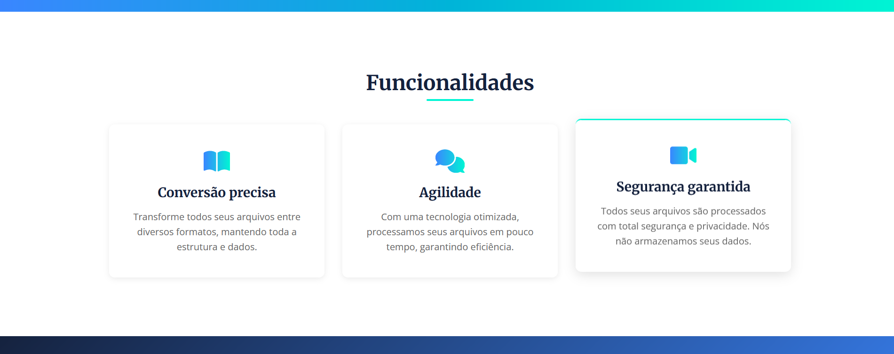

# Doc.Tec_GestaoStartup

Giulia Ramos Bagodi
Mateus Pereira de Oliveira
Marcel Marques
Vinicius Martins
Lucas Candido
Yuri Stockler

Landing Page - Parte inicial

_____________________________________________________________________________________________________________________

Landing Page - Parte dois

_____________________________________________________________________________________________________________________

Landing Page - Parte tres

_____________________________________________________________________________________________________________________

Landing Page - Parte quatro

Validacao no modelo com o numero de cliques, conseguimos um total de nove cliques de interessados, em um escopo pequeno

_____________________________________________________________________________________________________________________

Tela de login para o usuario, no momento funciona como ilustracao do modelo para um MVP

_____________________________________________________________________________________________________________________

Modelo de pagina do MVP do converso com todas as funcionalidades basicas
O usuario devera ser capaz de adicionar um arquivo que queira trocar o formato
Selecionar o formato desejado
clicar no botao de "converter arquivo" e o download sera feito automaticamente

_____________________________________________________________________________________________________________________
